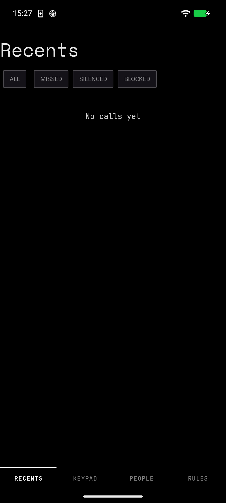

# XX-Phone
> The phone app that knows who is allowed to ring.

A default dialer for GrapheneOS with a ring-policy engine: spam never rings,
starred contacts always ring, and everyone else rings only when their window
says so — unknown numbers on their own ringtone, 9 to 5. All screening is local.
The app declares no `INTERNET` permission, and the build fails if that ever
changes.



**Status:** installed and holding both roles. `ROLE_DIALER` and
`ROLE_CALL_SCREENING` are held on a Pixel 6 running GrapheneOS, verified
on-device today. The pure-JVM policy core, the FactStore/telecom/ring layers,
every screen, and the WS0 probe APK are in-tree; 304 JVM tests green; no
`INTERNET` permission in either built APK.

**Not proven against a live SIM.** No real call has been placed, answered, or
screened through a carrier. The ring policy is proven by 66 truth-table tests
and nothing else. The four WS0 [VERIFY] answers in [PROBE.md](PROBE.md), the
daily-driver gate (WS7), and the instrumented suites are all still open.

**Spec:** [design.md](design.md) — the full design.
**Build plan:** [todo.md](todo.md) — workstreams, gates, and the order to do them in.
**Screens:** [design/xx-phone-screens.html](design/xx-phone-screens.html) — the mockup.

---

## The ring policy

First match wins, top to bottom:

| Caller | Rings | Tone |
|---|---|---|
| Emergency / emergency callback | always | default |
| Blocked or spam | never — rejected before the phone rings | — |
| ★ Starred contact | always | default |
| Business contact (label, not starred) | 09:00 – 19:00 | default |
| Saved contact | always | default |
| Unknown number you dialed in the last 48 h | always | unknown tone |
| Unknown number | 09:00 – 17:00 | **unknown tone** |

Outside a window a call is silenced, not rejected: it lands in Recents with the
rule that fired, and you can still grab it if you're looking at the phone. A
repeat caller (twice in 15 minutes) pierces any silence. **Expecting a call**
rings everything for a bounded 2 hours, then expires on its own. Blocking only
ever comes from an explicit signal — your blocklist, your pattern rules, a
failed STIR/SHAKEN attestation. A heuristic can silence a call; it can never eat
one.

And for the first week it silences nothing at all: **observe mode** rings every
call normally while the log records what it would have done. You flip
enforcement on after the log has proven itself; it is never flipped for you.

## Why a whole dialer

Because a call-screening app cannot change the ringtone — the system plays it.
The only app allowed to own the ringer is the default dialer. So XX-Phone is the
default dialer: keypad, recents, contacts, in-call screen, and the policy engine
that is the actual point.

## The ringtone 🔔

XX-Phone ships its own: `app/src/main/res/raw/xx_ringtone.mp3` on channel
`ring_default_v2`. Unknown callers keep their own tone (`xx_unknown`) on their
own channel, which is the whole reason a dialer was necessary.

The `_v2` is load-bearing. Android freezes a notification channel's sound at
creation and will not let you change it afterward, so a new tone means minting a
successor channel id and deleting the predecessor — never editing, never
reusing. Same rule applies every time the tone changes again.

## Two manifest bugs, since fixed 🐛

The roles were unassignable and the reason was four characters of namespace.
`XxInCallService` and `XxCallScreeningService` each declared
`android:permission="android.telecom.BIND_*"` where the platform requires
`android.permission.BIND_INCALL_SERVICE` and
`android.permission.BIND_SCREENING_SERVICE`. The system silently declined to
bind either service, so `RoleManager` had nothing to grant the role to. Both are
corrected; both roles now hold.

A third bug lived in Setup. The screen's "is setup complete" gate quietly
included `areNotificationsEnabled()`, but no Setup step surfaces or grants that
permission — so a false reading made the checklist inescapable and "Done — open
recents" looked like a dead button, bouncing every tab screen straight back to
Setup with zero feedback. Routing now depends on roles and channels only.
Notification health is a §15 warning, where it belongs.

## Theme sync 🎨

XX-Launcher broadcasts `xx.launcher.THEME_CHANGED` with the active theme's
display name and its resolved background ARGB, targeted at each family app. All
nine subscribe. XX-Phone's exported receiver resolves the name to a
`ThemePreset`, persists it to the ground store, and the UI repaints. Eight
choices: AMOLED Night, Graphite, Forest Night, Ocean Drift, Burgundy, Paper,
Mist, and Custom — Custom being the one that has no preset to resolve, so the
receiver takes the ARGB straight off the broadcast. A Custom broadcast missing
its background persists nothing rather than guessing. Verified live on-device.

## Family

Brand, tokens, and type come from
[piercingxx-branding](https://github.com/PiercingXX/piercingxx-branding). AMOLED
black, Signal white, Space Mono / JetBrains Mono. Same stack and conventions as
[Nope-Mode](https://github.com/PiercingXX/Nope-Mode), TxxT, and the Launcher.

Free and ad-free. Collects no personal data. Nothing this app sees ever leaves
your device.

## Build 🛠️

Built with JDK 21; the modules target JVM 17 bytecode. AGP 8.9.1, Kotlin 2.1.20,
Gradle 8.11.1. `compileSdk`/`targetSdk` 35, `minSdk` 31 — the Android SDK needs
`platforms;android-35` at minimum.

```
export ANDROID_HOME=$HOME/Android/Sdk
./gradlew :app:assembleDebug
adb install -r app/build/outputs/apk/debug/app-debug.apk
```

The WS0 probe builds separately: `./gradlew :probe:assembleDebug`, then follow
[PROBE.md](PROBE.md).

`verifyNoInternet` is wired `finalizedBy` on every debug assemble (`:app` and
`:probe`): it dumps the APK's declared permissions via `aapt2 dump permissions`
and fails the build if `android.permission.INTERNET` appears. The design.md
R8/D8 claim, enforced by the build rather than asserted in prose.

Tests, run today, all green:

| Module | Tests |
|---|---|
| `:core` (pure JVM policy engine — the §6 truth table) | 66 |
| `:app` | 238 |
| **Total** | **304** |

```
./gradlew :core:test :app:testDebugUnitTest
```

## First run

Setup claims `ROLE_DIALER` + `ROLE_CALL_SCREENING`, with the Restricted-Settings
walk-through for when a role request comes back not-held (design §4.1). The app
then starts in **observe mode** for a week — every call rings normally while the
log records what enforcement would have done. Enforcement is offered, never
flipped automatically (design §6, D13).
